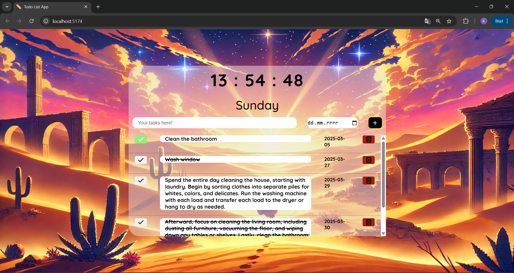
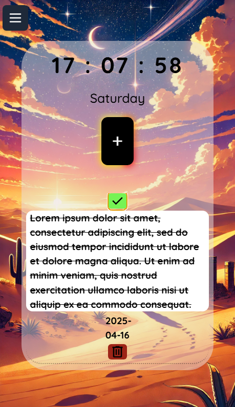

# ✅ Todo React App  - (React, HTML/CSS, Vite)

Responsywna aplikacja do zarządzania zadaniami (To-Do App) stworzona w React.

🎨**Screenshots** Desktop & Mobile
 



## ✨ Funkcjonalności
* **Dodawanie** nowych zadań
* **Oznaczanie** zadań jako wykonane
* **Usuwanie** zadań z listy
* **Intuicyjny i responsywny interfejs użytkownika**

## 🛠 Technologie
* **React** – biblioteka do budowy interfejsu użytkownika
* **CSS** – stylowanie aplikacji
* **Vite** – szybkie środowisko dla React
* **JavaScript (ES6+)** – logika aplikacji

## 🚀 Uruchomienie aplikacji
1. **Zainstaluj zależności**:
   ```sh
   npm install
2. **Urochom aplikację**:
   ```sh
   npm start
3. **Otwórz w przeglądarce**:
   Wyswietlony: htttp://localhost:{PORT}